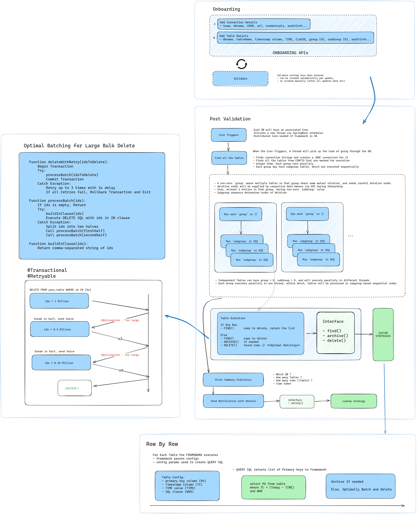

# Common Data Retention Platform

## **Preface: Why Move Purging Logic to the Java Layer?**

Different teams managed `stored procedures` in different ways, and need arose for a standardized solution, particularly for sensitive data compliance. A Java-based solution addresses these challenges effectively:

- **Version Control & Peer Review**: Ensures changes are traceable, reviewed, and maintainable via a structured process.
- **Standardization**: Centralizes logic for consistency and avoids team-specific fragmentation.
- **Auditability**: Provides detailed logs for compliance and monitoring.
- **Scalability & Flexibility**: Supports multiple databases, dynamic configurations, and integration with archival systems.
- **Ease of Maintenance**: Simplifies debugging and updates, reducing reliance on database-specific features.

This approach enhances compliance, maintainability, and scalability while aligning with modern development practices.

---

## **Objective**

A common platform to archive and delete data records past their retention period, built on a flexible framework that supports multiple strategies for purging and archiving.

### **Key Features**

- **Dry-Run Capability**: Previews the impact of purging (e.g., number of rows to delete).
- **Distributed Locking**: If Purge is running in HA, Ensures no concurrent purge execution on the same table.
- **Custom Purge Options**: Dynamic purging stratgies at runtime.
- **Custom Archival Options**: Dynamic archival stratgies at runtime.
- **Custom Notification Integration**: Dynamic notification stratgies at runtime.

This framework provides a unified, scalable, and auditable solution for data retention management.

---

## **Architecture Overview**

Below is an overview of the platform architecture:

**Legend**

- **Blue Region**: Represents the **common framework**, responsible for onboarding, validation, execution, and reporting.
- **Green Region**: Represents **custom strategies** that are dynamically invoked based on configuration (e.g., deletion by partition or row-by-row).

---

## **Onboarding**

Onboarding involves providing the configuration details for databases and tables.

### Ingestion

API methods will exist to upload these details in chunks (or whole if needed)

1. **Connection Details**:

   - Team
   - Database Connection Url
   - Encrypted Credentials
   - CRON
   - Audit information. (any Metadata, created/updated timestamps etc)

2. **Table Details**:
   - Table name.
   - Primary key columns for identifying rows uniquely.
   - Timestamp column and retention duration. (These work together)
   - Custom SQL `where clause` for arbitrarily complex business logic
   - Audit information.

### Validation

Before Purge can execute, the configurations need to be validated. Validation can be triggered:

- after every Onboarding APIs executes
- through a custom endpoint (in case we want overall validation for some reason)

**Validation Rules**
(these will be explained when explaining the Flow)

- Valid CRON must exist for DB
- ConnectionUrl is reachable (? might not work immediately after adding because of permission grants etc)
- Group, subgroup non-negative
- zero group means zero subgroup ... etc

---

## **Framework Execution Flow**

Only when validation passes, can the framework be primed for execution. Below is the high-level flow:

### **Steps**:

1. **Job Execution**: Triggered via cron or an external event.
2. **Valid Check**: Ensure the config for the DB/Tables we are executing are valid.
3. **Optimization**: Groups tables based on dependencies. Groups run in parallel, tables in each group run in sequence.
4. **Execution**:
   - **Find**: Identify rows or partitions to delete based on custom SQL logic and timestamp retention. (or by partition)
   - **Archive (Optional)**: Backup data before deletion.
   - **Delete**: Execute the deletion logic.
5. **Summary Statistics**: Log results (e.g., rows deleted, rows archived).
6. **Notification**: Send completion details via email or other channels.

### Optimal Batching

- Tries to delete all rows at once
- if cannot, only then breaks population into half and tries again
- This leads to least number of batches, lowering network and initialization induced latencies
- Empirically tested to give fastest results :: Intuition: larger batch leads to faster execution

**Flow Diagram**

---

## Custom Deletion Strategies

### **Row-by-Row Strategy**

_This is discussed in the Flow diagram_

- Dynamically identifies rows to purge using the custom `where clause` and timestamp retention logic.
- Archives data using extracted primary keys before deletion.
- Deletes rows individually to ensure precision and compliance.

**Pros**

- Very fast `Find` stage <- uses a `covered query`
- Very fast `Delete` stage <- through `Optimal Batching`
- BAU not affected, downtime not required <- Primary key based deletion ensures no table-level lock

**Cons**

- Still slower than Partition/Table drop

### **By Partition Strategy**

- Suitable for tables with proper time-range partitions.
- Drops partitions that are older than the retention period.

**Pros**

- Very fast, less overhead on DB

**Cons**:

- Requires all team DB tables to be partitioned through time range : May not be feasible

### **Table Swap Strategy**

Works well when data to delete >> Data to keep

- mark rows NOT for delete
- move marked rows to temp table
- DROP Table, and then create a new one with same name
- move temp rows back to table

**Pros**

- Very fast `Find` stage <- uses a `covered query`
- Fastest deletion possible
- No need for partition logic

**Cons**

- Creating TEMP tables, DROP-ing tables : May not get permission
- RISKY

---

---
